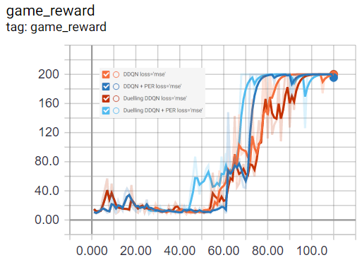

# CartPole-v0
Reinforcement Learning project to train a neural network to play the
[OpenAI](https://openai.com/) environment [CartPole-v0](https://github.com/openai/gym/wiki/CartPole-v0).  


### Objectives


## Additional Information
Tensorflow Version: GPU 2.0.0

## Installation
1. Create and activate a new environment.
```
conda create -n openai python=3.6
source activate openai
```
2. Install Dependencies.
```
pip install -r requirements.txt
pip install gym[atari]
```

### Launch Jupyter notebook
```
jupyter notebook CartPole-v0.ipynb
```

### Additional commands
Starts Tensorboard Visualisation.
```
tensorboard --logdir=logs/
```

#### Rewards

 
